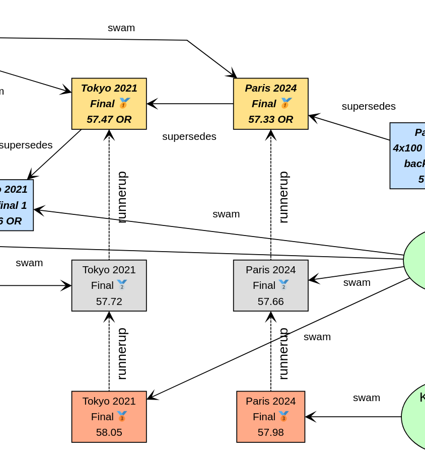
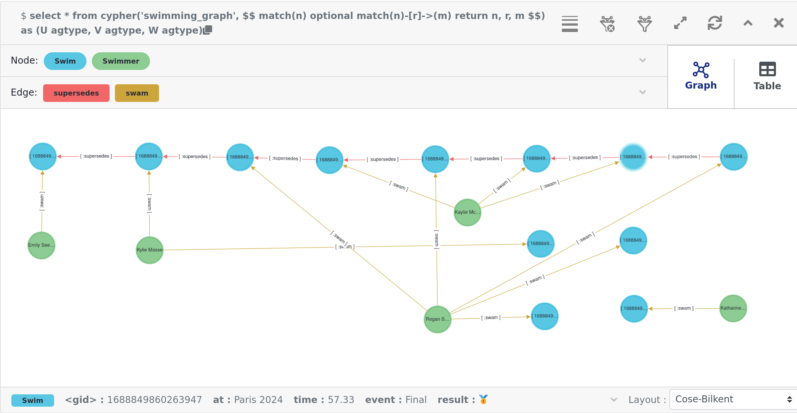
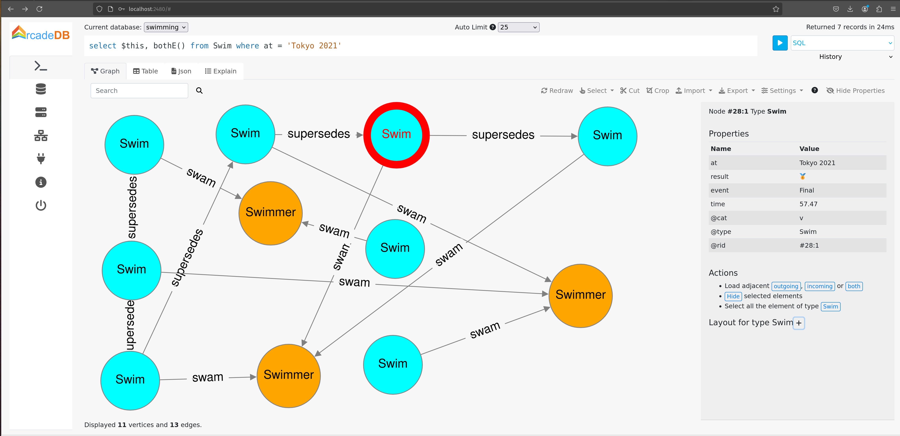

= Using Graph Databases with Groovy
Paul King
:revdate: 2024-08-20T10:18:00+00:00
:keywords: tugraph, tinkerpop, gremlin, neo4j, apache age, graph databases, apache hugegraph, orientdb, arcadedb, orientdb, groovy
:draft: true
:description: This post illustrates using graph databases with Groovy.

The Olympics is over for another 4 years. For sports fans, there were many exciting moments.
Let's look at just one event where the Olympic record was broken several times over the
last three years. We'll look at the women's 100m backstroke and model the results as a graph database.

We'll have vertices in our graph database corresponding to the swimmers and the swims.
We'll use the labels `swimmer` and `swim` for these vertices. We'll have relationships
such as `swam` and `supercedes` between vertices. We'll explore modelling and querying the event
information using several graph database technologies.

The examples in this post can be found on
https://github.com/paulk-asert/groovy-graphdb/[GitHub].

== Apache TinkerPop

Our first technology to examine is https://tinkerpop.apache.org/[Apache TinkerPop™].

image:https://tinkerpop.apache.org/img/tinkerpop-splash.png[tinkerpop logo,70%]

TinkerPop is an open source computing framework for graph databases. It provides
a common abstraction layer, and a graph query language, called Gremlin.
This allows you to work with numerous graph database implementations in a consistent way.
TinkerPop also provides its own graph engine implementation, called TinkerGraph, which is what
we'll use initially.

We'll look at the swims for the medalists and record breakers at the Tokyo 2021 and Paris 2024 Olympics
in the women's 100m backstroke. For reference purposes, we'll also include the previous swim that
set an olympic record.

We'll start by creating a new in-memory graph database and
create a helper object for traversing the graph:

[source,groovy]
----
var graph = TinkerGraph.open()
var g = traversal().withEmbedded(graph)
----

Next, let's create the information relevant for the previous Olympic record which was set
at the London 2012 Olympics. Emily Seebohm set that record in Heat 4:

[source,groovy]
----
var es = g.addV('swimmer').property(name: 'Emily Seebohm', country: '🇦🇺').next()
swim1 = g.addV('swim').property(at: 'London 2012', event: 'Heat 4', time: 58.23, result: 'First').next()
es.addEdge('swam', swim1)
----

We can print out some information from our newly created nodes (vertices)
by querying the properties of two nodes respectively:

[source,groovy]
----
var (name, country) = ['name', 'country'].collect { es.property(it).value() }
var (at, event, time) = ['at', 'event', 'time'].collect { swim1.property(it).value() }
println "$name from $country swam a time of $time in $event at the $at Olympics"
----

Which has this output:

----
Emily Seebohm from 🇦🇺 swam a time of 58.23 in Heat 4 at the London 2012 Olympics
----

So far, we've just been using the Java API from TinkerPop.
It also provides some additional syntactic sugar for Groovy.
We can enable the syntactic sugar with:

[source,groovy]
----
SugarLoader.load()
----

Which then lets us write the slightly shorter:

[source,groovy]
----
println "$es.name from $es.country swam a time of $swim1.time in $swim1.event at the $swim1.at Olympics"
----

This uses Groovy's normal property access syntax and has the same output when executed.

Let's create some helper methods to simplify creation of the remaining information.

[source,groovy]
----
def insertSwimmer(TraversalSource g, name, country) {
    g.addV('swimmer').property(name: name, country: country).next()
}

def insertSwim(TraversalSource g, at, event, time, result, swimmer) {
    var swim = g.addV('swim').property(at: at, event: event, time: time, result: result).next()
    swimmer.addEdge('swam', swim)
    swim
}
----

Now we can create the remaining swim information:

[source,groovy]
----
var km = insertSwimmer(g, 'Kylie Masse', '🇨🇦')
var swim2 = insertSwim(g, 'Tokyo 2021', 'Heat 4', 58.17, 'First', km)
swim2.addEdge('supercedes', swim1)
var swim3 = insertSwim(g, 'Tokyo 2021', 'Final', 57.72, '🥈', km)

var rs = insertSwimmer(g, 'Regan Smith', '🇺🇸')
var swim4 = insertSwim(g, 'Tokyo 2021', 'Heat 5', 57.96, 'First', rs)
swim4.addEdge('supercedes', swim2)
var swim5 = insertSwim(g, 'Tokyo 2021', 'Semifinal 1', 57.86, '', rs)
var swim6 = insertSwim(g, 'Tokyo 2021', 'Final', 58.05, '🥉', rs)
var swim7 = insertSwim(g, 'Paris 2024', 'Final', 57.66, '🥈', rs)
var swim8 = insertSwim(g, 'Paris 2024', 'Relay leg1', 57.28, 'First', rs)

var kmk = insertSwimmer(g, 'Kaylie McKeown', '🇦🇺')
var swim9 = insertSwim(g, 'Tokyo 2021', 'Heat 6', 57.88, 'First', kmk)
swim9.addEdge('supercedes', swim4)
swim5.addEdge('supercedes', swim9)
var swim10 = insertSwim(g, 'Tokyo 2021', 'Final', 57.47, '🥇', kmk)
swim10.addEdge('supercedes', swim5)
var swim11 = insertSwim(g, 'Paris 2024', 'Final', 57.33, '🥇', kmk)
swim11.addEdge('supercedes', swim10)
swim8.addEdge('supercedes', swim11)

var kb = insertSwimmer(g, 'Katharine Berkoff', '🇺🇸')
var swim12 = insertSwim(g, 'Paris 2024', 'Final', 57.98, '🥉', kb)
----

Note that we just entered the swims where medals were won or
where olympic records were broken. We could easily have added
more swimmers, other strokes and distances, and even other sports
if we wanted to.

Let's have a look at what our graph now looks like:

image:https://raw.githubusercontent.com/paulk-asert/groovy-graphdb/main/docs/images/BackstrokeRecords.png[network of swim and swimmer vertices and relationship edges]

We now might want to query the graph in numerous ways.
For instance, what countries had success at the Paris 2024 olympics,
where success is defined for the purposes of this query as
winning a medal or breaking a record. Of course, just having
a swimmer make the olympic team is a great success - but let's
keep our example simple for now.

[source,groovy]
----
var successInParis = g.V().out('swam').has('at', 'Paris 2024').in()
    .values('country').toSet()
assert successInParis == ['🇺🇸', '🇦🇺'] as Set
----

By way of explanation, we find all nodes with an outgoing `swam` edge
pointing to a swim that was at the Paris 2024 olympics, i.e.
all the swimmers from Paris 2024. We then find the set of countries
represented. We are using sets here to remove duplicates, and also
we aren't imposing an ordering on the returned results so we compare
sets on both sides.

Similarly, we can find the olympic records set during heat swims:

[source,groovy]
----
var recordSetInHeat = g.V().hasLabel('swim')
    .filter { it.get().property('event').value().startsWith('Heat') }
    .values('at').toSet()
assert recordSetInHeat == ['London 2012', 'Tokyo 2021'] as Set
----

Or, we can find the times of the records set during finals:

[source,groovy]
----
var recordTimesInFinals = g.V().has('event', 'Final').as('ev').out('supersedes')
    .select('ev').values('time').toSet()
assert recordTimesInFinals == [57.47, 57.33] as Set
----

Making use of the Groovy syntactic sugar gives simpler versions:

[source,groovy]
----
var successInParis = g.V.out('swam').has('at', 'Paris 2024').in.country.toSet
assert successInParis == ['🇺🇸', '🇦🇺'] as Set

var recordSetInHeat = g.V.hasLabel('Swim').filter { it.event.startsWith('Heat') }.at.toSet
assert recordSetInHeat == ['London 2012', 'Tokyo 2021'] as Set

var recordTimesInFinals = g.V.has('event', 'Final').as('ev').out('supersedes').select('ev').time.toSet
assert recordTimesInFinals == [57.47, 57.33] as Set
----

But graph databases really excel when performing queries
involving multiple edge traversals. Here is one looking
at all the olympic records set in 2021 and 2024:

[source,groovy]
----
println "Olympic records after ${g.V(swim1).values('at', 'event').toList().join(' ')}: "
println g.V(swim1).repeat(in('supersedes')).as('sw').emit()
    .values('at').concat(' ')
    .concat(select('sw').values('event')).toList().join('\n')
----

Or after using the Groovy syntactic sugar, the query becomes:

[source,groovy]
----
println g.V(swim1).repeat(in('supersedes')).as('sw').emit
    .at.concat(' ').concat(select('sw').event).toList.join('\n')
----

Both have this output:

----
Olympic records after London 2012 Heat 4:
Tokyo 2021 Heat 4
Tokyo 2021 Heat 5
Tokyo 2021 Heat 6
Tokyo 2021 Semifinal 1
Tokyo 2021 Final
Paris 2024 Final
Paris 2024 Relay leg1
----

As a side note, TinkerPop has a `GraphMLWriter` class which can write out our
graph in _GraphML_, which is how the above image was created.

== Neo4j

Our next technology to examine is
https://neo4j.com/product/neo4j-graph-database/[neo4j]. Neo4j is a graph
database storing nodes and edges. Nodes and edges may have a label and properties (or attributes).

image:https://dist.neo4j.com/wp-content/uploads/20230926084108/Logo_FullColor_RGB_TransBG.svg[neo4j logo,50%]

Neo4j models edge relationships using enums. Let's create an enum for our example:

[source,groovy]
----
enum SwimmingRelationships implements RelationshipType {
    swam, supersedes, runnerup
}
----

We'll use Neo4j in embedded mode and perform all of our operations
as part of a transaction:

[source,groovy]
----
// ... set up managementService ...
var graphDb = managementService.database(DEFAULT_DATABASE_NAME)

try (Transaction tx = graphDb.beginTx()) {
    // ... other Neo4j code below here ...
}
----

Let's create our nodes and edges using Neo4j. First the existing Olympic record:

[source,groovy]
----
es = tx.createNode(label('Swimmer'))
es.setProperty('name', 'Emily Seebohm')
es.setProperty('country', '🇦🇺')

swim1 = tx.createNode(label('Swim'))
swim1.setProperty('event', 'Heat 4')
swim1.setProperty('at', 'London 2012')
swim1.setProperty('result', 'First')
swim1.setProperty('time', 58.23d)
es.createRelationshipTo(swim1, swam)

var name = es.getProperty('name')
var country = es.getProperty('country')
var at = swim1.getProperty('at')
var event = swim1.getProperty('event')
var time = swim1.getProperty('time')
println "$name from $country swam a time of $time in $event at the $at Olympics"
----

While there is nothing wrong with this code, Groovy has many features for making code more succinct.
Let's use some dynamic metaprogramming to achieve just that.

[source,groovy]
----
Node.metaClass {
    propertyMissing { String name, val -> delegate.setProperty(name, val) }
    propertyMissing { String name -> delegate.getProperty(name) }
    methodMissing { String name, args ->
        delegate.createRelationshipTo(args[0], SwimmingRelationships."$name")
    }
}
----

Now we use normal Groovy property access for setting the node properties. It looks much cleaner.
We define an edge relationship simply by calling a method having the relationship name.

[source,groovy]
----
km = tx.createNode(label('swimmer'))
km.name = 'Kylie Masse'
km.country = '🇨🇦'

swim2 = tx.createNode(label('swim'))
swim2.time = 58.17d
swim2.result = 'First'
swim2.event = 'Heat 4'
swim2.at = 'Tokyo 2021'
km.swam(swim2)
swim2.supercedes(swim1)

swim3 = tx.createNode(label('swim'))
swim3.time = 57.72d
swim3.result = '🥈'
swim3.event = 'Final'
swim3.at = 'Tokyo 2021'
km.swam(swim3)
----

The code is certainly a lot cleaner, and it was quite a minimal amount of work to define the necessary
metaprogramming. With a little bit more work, we could use static metaprogramming techniques.
This would give us better IDE completion.

Another interesting topic which we won't elaborate here is stronger type checking for graphs.
For graph libraries which support schemas, the types for node and edge properties can be defined,
as can the allowable nodes applicable to any edge relationship. For such systems, if you try to
define a poorly-typed property, or incorrectly use a relationship, you will receive a runtime error.
Groovy lets us take things further, if we want, and if we are willing to do a little more work.
For example, if the schema is available at compile time, we could write a type checking extension
which would fail compilation if any invalid edge or vertex definitions were detected.

For now though, let's continue with defining the rest of our graph.
We can redefine our `insertSwimmer` and `insertSwim` methods using Neo4j implementation
calls, and then our earlier code could be used to create our graph. Now let's
investigate what the queries look like.

First, the successful countries in Paris 2024:

[source,groovy]
----
var swimmers = [es, km, rs, kmk, kb]
var successInParis = swimmers.findAll { swimmer ->
    swimmer.getRelationships(swam).any { run ->
        run.getOtherNode(swimmer).at == 'Paris 2024'
    }
}
assert successInParis*.country.unique() == ['🇺🇸', '🇦🇺']
----

Then, at which olympics were records broken in heats:

[source,groovy]
----
var swims = [swim1, swim2, swim3, swim4, swim5, swim6, swim7, swim8, swim9, swim10, swim11, swim12]
var recordSetInHeat = swims.findAll { swim ->
    swim.event.startsWith('Heat')
}*.at
assert recordSetInHeat.unique() == ['London 2012', 'Tokyo 2021']
----

Now, what were the times for records broken in finals:

[source,groovy]
----
var recordTimesInFinals = swims.findAll { swim ->
    swim.event == 'Final' && swim.hasRelationship(supercedes)
}*.time
assert recordTimesInFinals == [57.47d, 57.33d]
----

To see traversal in action, Neo4j has a special API for doing such queries:

[source,groovy]
----
var info = { s -> "$s.at $s.event" }
println "Olympic records following ${info(swim1)}:"

for (Path p in tx.traversalDescription()
    .breadthFirst()
    .relationships(supersedes)
    .evaluator(Evaluators.fromDepth(1))
    .uniqueness(Uniqueness.NONE)
    .traverse(swim1)) {
    println p.endNode().with(info)
}
----

Earlier versions of Neo4j also supported Gremlin, so we could have written our queries in
the same was as we did for TinkerPop. That technology is deprecated for Neo4j, and instead
they now offer a Cypher query language. We can use that language for all of our previous queries
as shown here:

[source,groovy]
----
assert tx.execute('''
MATCH (s:Swim WHERE s.event STARTS WITH 'Heat')
WITH s.at as at
WITH DISTINCT at
RETURN at
''')*.at == ['London 2012', 'Tokyo 2021']

assert tx.execute('''
MATCH (s1:Swim {event: 'Final'})-[:supersedes]->(s2:Swim)
RETURN s1.time AS time
''')*.time == [57.47d, 57.33d]

tx.execute('''
MATCH (s1:Swim)-[:supersedes]->{1,}(s2:Swim { at: $at })
RETURN s1
''', [at: swim1.at])*.s1.each { s ->
    println "$s.at $s.event"
}
----

=== An aside on graph design

This blog post is definitely, not meant to be an advanced course on graph database
design, but it is worth pointing out a few points.

Deciding which information should be stored as node properties and which as relationships
still requires developer judgement. For example, we could have added a Boolean `olympicRecord`
property to our `Swim` nodes. Certain queries might now become simpler, or at least more familiar
to traditional RDBMS SQL developers, but other queries might become much harder to write
and potentially much less efficient.
This is the kind of thing which needs to be thought through and sometimes experimented with.

Suppose, in the case where a record is broken, we wanted to see which other swimmers
(in our case medallists in the final) also broke the previous record.
We could write a query to find this as follows:

[source,groovy]
----
assert tx.execute('''
MATCH (sr1:swimmer)-[:swam]->(sm1:swim {event: 'Final'}), (sm2:swim {event: 'Final'})-[:supercedes]->(sm3:swim)
WHERE sm1.at = sm2.at AND sm1 <> sm2 AND sm1.time < sm3.time
RETURN sr1.name as name
''')*.name == ['Kylie Masse']
----

It's not too bad, but if we had a much larger graph of data, it could be quite slow.
We could instead opt to use an additional relationship, called `runnerup` in our graph.

[source,groovy]
----
swim6.runnerup(swim3)
swim3.runnerup(swim10)
swim12.runnerup(swim7)
swim7.runnerup(swim11)
----

The visualization is something like this:

It essentially makes it easier to find the other medalists if we know any one of them.

The resulting query becomes this:

[source,groovy]
----
assert tx.execute('''
MATCH (sr1:swimmer)-[:swam]->(sm1:swim {event: 'Final'})-[:runnerup]->{1,2}(sm2:swim {event: 'Final'})-[:supercedes]->(sm3:swim)
WHERE sm1.time < sm3.time
RETURN sr1.name as name
''')*.name == ['Kylie Masse']
----

The _MATCH_ clause is similar in complexity, the _WHERE_ clause is much simpler.
The query is probably faster too, but it is a tradeoff that should be weighed up.

== Apache AGE

The next technology we'll look at is the https://age.apache.org/[Apache AGE™] graph database.
Apache AGE leverages https://www.postgresql.org[PostgreSQL] for storage.

image:https://age.apache.org/age-manual/master/_static/logo.png[Apache AGE logo, 50%]
image:https://age.apache.org/img/logo-large-postgresql.jpg[PostgreSQL logo]

We installed Apache AGE via a Docker Image as outlined in the Apache AGE
https://age.apache.org/age-manual/master/intro/setup.html#installing-via-docker-image[manual].

Since Apache AGE offers a SQL-inspired graph database experience, we use Groovy's
SQL facilities to interact with the database:

[source,groovy]
----
Sql.withInstance(DB_URL, USER, PASS, 'org.postgresql.jdbc.PgConnection') { sql ->
    // enable Apache AGE extension, then use Sql connection ...
}
----

For creating our nodes and subsequent querying, we use SQL statements
with embedded _cypher_ clauses. Here is the statement for creating
out nodes and edges:

[source,groovy]
----
sql.execute'''
    SELECT * FROM cypher('swimming_graph', $$ CREATE
    (es:Swimmer {name: 'Emily Seebohm', country: '🇦🇺'}),
    (swim1:Swim {event: 'Heat 4', result: 'First', time: 58.23, at: 'London 2012'}),
    (es)-[:swam]->(swim1),

    (km:Swimmer {name: 'Kylie Masse', country: '🇨🇦'}),
    (swim2:Swim {event: 'Heat 4', result: 'First', time: 58.17, at: 'Tokyo 2021'}),
    (km)-[:swam]->(swim2),
    (swim2)-[:supersedes]->(swim1),
    (swim3:Swim {event: 'Final', result: '🥈', time: 57.72, at: 'Tokyo 2021'}),
    (km)-[:swam]->(swim3),

    (rs:Swimmer {name: 'Regan Smith', country: '🇺🇸'}),
    (swim4:Swim {event: 'Heat 5', result: 'First', time: 57.96, at: 'Tokyo 2021'}),
    (rs)-[:swam]->(swim4),
    (swim4)-[:supersedes]->(swim2),
    (swim5:Swim {event: 'Semifinal 1', result: 'First', time: 57.86, at: 'Tokyo 2021'}),
    (rs)-[:swam]->(swim5),
    (swim6:Swim {event: 'Final', result: '🥉', time: 58.05, at: 'Tokyo 2021'}),
    (rs)-[:swam]->(swim6),
    (swim7:Swim {event: 'Final', result: '🥈', time: 57.66, at: 'Paris 2024'}),
    (rs)-[:swam]->(swim7),
    (swim8:Swim {event: 'Relay leg1', result: 'First', time: 57.28, at: 'Paris 2024'}),
    (rs)-[:swam]->(swim8),

    (kmk:Swimmer {name: 'Kaylie McKeown', country: '🇦🇺'}),
    (swim9:Swim {event: 'Heat 6', result: 'First', time: 57.88, at: 'Tokyo 2021'}),
    (kmk)-[:swam]->(swim9),
    (swim9)-[:supersedes]->(swim4),
    (swim5)-[:supersedes]->(swim9),
    (swim10:Swim {event: 'Final', result: '🥇', time: 57.47, at: 'Tokyo 2021'}),
    (kmk)-[:swam]->(swim10),
    (swim10)-[:supersedes]->(swim5),
    (swim11:Swim {event: 'Final', result: '🥇', time: 57.33, at: 'Paris 2024'}),
    (kmk)-[:swam]->(swim11),
    (swim11)-[:supersedes]->(swim10),
    (swim8)-[:supersedes]->(swim11),

    (kb:Swimmer {name: 'Katharine Berkoff', country: '🇺🇸'}),
    (swim12:Swim {event: 'Final', result: '🥉', time: 57.98, at: 'Paris 2024'}),
    (kb)-[:swam]->(swim12)
    $$) AS (a agtype)
'''
----

To find which olympics where records were set in heats, we
can use the following _cypher_ query:

[source,groovy]
----
assert sql.rows('''
    SELECT * from cypher('swimming_graph', $$
    MATCH (s:swim)
    WHERE left(s.event, 4) = 'Heat'
    RETURN s
    $$) AS (a agtype)
''').a*.map*.get('properties')*.at.toUnique() == ['London 2012', 'Tokyo 2021']
----

The results come back in a special JSON-like data type called `agtype`.
From that, we can query the properties and return the `at` property.
We select the unique ones to remove duplicates.

Similarly, we can find the times of olympic records set in finals
as follows:

[source,groovy]
----
assert sql.rows('''
    SELECT * from cypher('swimming_graph', $$
    MATCH (s1:Swim {event: 'Final'})-[:supersedes]->(s2:Swim)
    RETURN s1
    $$) AS (a agtype)
''').a*.map*.get('properties')*.time == [57.47, 57.33]
----

To print all the olympic records set across Tokyo 2021 and Paris 2024,
we can use `eachRow` and the following query:

[source,groovy]
----
sql.eachRow('''
    SELECT * from cypher('swimming_graph', $$
    MATCH (s1:Swim)-[:supersedes]->(swim1)
    RETURN s1
    $$) AS (a agtype)
''') {
    println it.a*.map*.get('properties')[0].with{ "$it.at $it.event" }
}
----

The output looks like this:

----
Tokyo 2021 Heat 4
Tokyo 2021 Heat 5
Tokyo 2021 Heat 6
Tokyo 2021 Final
Tokyo 2021 Semifinal 1
Paris 2024 Final
Paris 2024 Relay leg1
----

The Apache AGE project also maintains a viewer tool offering a web-based
user interface for visualization of graph data stored in our database.
Instructions for installation are available on the
https://github.com/apache/age-viewer[GitHub site].
The tool allows visualization of the results from any query.
For our database, a query returning all nodes and edges creates
a visualization like below (we chose to manually re-arrange the nodes):

== OrientDB

image:https://www.orientdb.com/images/orientdb_logo_mid.png[orientdb logo,50%]

The next graph database we'll look at is https://orientdb.org/[OrientDB].
We used the open source Community edition. We used it in embedded mode but there are
https://orientdb.org/docs/3.0.x/gettingstarted/Tutorial-Installation.html[instructions]
for running a docker image as well.

The main claim to fame for OrientDB (and the closely related ArcadeDB we'll cover next)
is that they are multi-model databases, supporting graphs and documents
in the one database.

Creating our database and setting up our vertex and edge classes (think mini-schema)
is done as follows:

[source,groovy]
----
try (var db = context.open("swimming", "admin", "adminpwd")) {
    db.createVertexClass('Swimmer')
    db.createVertexClass('Swim')
    db.createEdgeClass('swam')
    db.createEdgeClass('supersedes')
    // other code here
}
----

See the https://github.com/paulk-asert/groovy-graphdb/tree/main/orientdb[GitHub repo] for further details.

With initialization out fo the way, we can start defining our nodes and edges:

[source,groovy]
----
var es = db.newVertex('Swimmer')
es.setProperty('name', 'Emily Seebohm')
es.setProperty('country', '🇦🇺')
var swim1 = db.newVertex('Swim')
swim1.setProperty('at', 'London 2012')
swim1.setProperty('result', 'First')
swim1.setProperty('event', 'Heat 4')
swim1.setProperty('time', 58.23)
es.addEdge(swim1, 'swam')
----

We can print out the details as before:

[source,groovy]
----
var (name, country) = ['name', 'country'].collect { es.getProperty(it) }
var (at, event, time) = ['at', 'event', 'time'].collect { swim1.getProperty(it) }
println "$name from $country swam a time of $time in $event at the $at Olympics"
----

At this point, we could apply some Groovy metaprogramming to make the code more succinct,
but we'll just flesh out our `insertSwimmer` and `insertSwim` helper methods like before.
We can use these to enter the remaining swim information.

Queries are performed using the Multi-Model API using SQL-like queries.
Our three queries we've seen earlier look like this:

[source,groovy]
----
var results = db.query("SELECT expand(out('supersedes').in('supersedes')) FROM Swim WHERE event = 'Final'")
assert results*.getProperty('time').toSet() == [57.47, 57.33] as Set

results = db.query("SELECT expand(out('supersedes')) FROM Swim WHERE event.left(4) = 'Heat'")
assert results*.getProperty('at').toSet() == ['Tokyo 2021', 'London 2012'] as Set

results = db.query("SELECT country FROM ( SELECT expand(in('swam')) FROM Swim WHERE at = 'Paris 2024' )")
assert results*.getProperty('country').toSet() == ['🇺🇸', '🇦🇺'] as Set
----

Traversal looks like this:

[source,groovy]
----
results = db.query("TRAVERSE in('supersedes') FROM :swim", swim1)
results.each {
    if (it.toElement() != swim1) {
        println "${it.getProperty('at')} ${it.getProperty('event')}"
    }
}
----

OrientDB also supports Gremlin and a studio Web-UI.
Both of these features are very similar to the ArcadeDB counterparts.
We'll examine them next when we look at ArcadeDB.

== ArcadeDB

Now, we'll examine https://arcadedb.com/#getting-started[ArcadeDB].

image:https://arcadedb.com/assets/images/arcadedb-logo-mini.png[arcadedb logo]

ArcadeDB is a rewrite/partial fork of OrientDB and carries over its Multi-Model nature.
We used it in embedded mode but there are
https://arcadedb.com/#getting-started[instructions] for running a docker image if you prefer.

Not surprisingly, some usage of ArcadeDB is very similar to OrientDB. Initialization
changes slightly:

[source,groovy]
----
var factory = new DatabaseFactory("swimming")

try (var db = factory.create()) {
    db.transaction { ->
        db.schema.with {
            createVertexType('Swimmer')
            createVertexType('Swim')
            createEdgeType('swam')
            createEdgeType('supersedes')
        }
        // ... other code goes here ...
    }
}
----

Defining the existing record information is done as follows:

[source,groovy]
----
var es = db.newVertex('Swimmer')
es.set(name: 'Emily Seebohm', country: '🇦🇺').save()

var swim1 = db.newVertex('Swim')
swim1.set(at: 'London 2012', result: 'First', event: 'Heat 4', time: 58.23).save()
swim1.newEdge('swam', es, false).save()
----

Accessing the information can be done like this:

[source,groovy]
----
var (name, country) = ['name', 'country'].collect { es.get(it) }
var (at, event, time) = ['at', 'event', 'time'].collect { swim1.get(it) }
println "$name from $country swam a time of $time in $event at the $at Olympics"
----

ArcadeDB supports multiple query languages. The SQL-like language mirrors the OrientDB offering.
Here are our three now familiar queries:

[source,groovy]
----
var results = db.query('SQL', '''
SELECT expand(outV()) FROM (SELECT expand(outE('supersedes')) FROM Swim WHERE event = 'Final')
''')
assert results*.toMap().time.toSet() == [57.47, 57.33] as Set

results = db.query('SQL', "SELECT expand(outV()) FROM (SELECT expand(outE('supersedes')) FROM Swim WHERE event.left(4) = 'Heat')")
assert results*.toMap().at.toSet() == ['Tokyo 2021', 'London 2012'] as Set

results = db.query('SQL', "SELECT country FROM ( SELECT expand(out('swam')) FROM Swim WHERE at = 'Paris 2024' )")
assert results*.toMap().country.toSet() == ['🇺🇸', '🇦🇺'] as Set
----

Here is our traversal example:

[source,groovy]
----
results = db.query('SQL', "TRAVERSE out('supersedes') FROM :swim", swim1)
results.each {
    if (it.toElement() != swim1) {
        var props = it.toMap()
        println "$props.at $props.event"
    }
}
----

ArcadeDB also supports Cypher queries (like Neo4j). The times for records in finals query
using the Cypher dialect looks like this:

[source,groovy]
----
results = db.query('cypher', '''
MATCH (s1:Swim {event: 'Final'})-[:supersedes]->(s2:Swim)
RETURN s1.time AS time
''')
assert results*.toMap().time.toSet() == [57.47, 57.33] as Set
----

ArcadeDB also supports Gremlin queries. The times for records in finals query
using the Gremlin dialect looks like this:

[source,groovy]
----
results = db.query('gremlin', '''
g.V().has('event', 'Final').as('ev').out('supersedes').select('ev').values('time')
''')
assert results*.toMap().result.toSet() == [57.47, 57.33] as Set
----

Rather than just passing a Gremlin query as a String, we can get full access to the TinkerPop environment
as this example show:

[source,groovy]
----
try (final ArcadeGraph graph = ArcadeGraph.open("swimming")) {
    var recordTimesInFinals = graph.traversal().V().has('event', 'Final').as('ev').out('supersedes')
        .select('ev').values('time').toSet()
    assert recordTimesInFinals == [57.47, 57.33] as Set
}
----

ArcadeDB also supports a Studio Web-UI. Here is an example of using Studio
with a query that looks at all nodes and edges associated with the Tokyo 2021 olympics:

== TuGraph

Next, we'll look at
https://tugraph.tech/[TuGraph].

image:https://mdn.alipayobjects.com/huamei_qcdryc/afts/img/A*AbamQ5lxv0IAAAAAAAAAAAAADgOBAQ/original[tugraph logo,width=40%]

We used the Community Edition using a docker image as outlined in the
https://tugraph-db.readthedocs.io/en/latest/5.installation%26running/3.docker-deployment.html[documentation] and
https://blog.csdn.net/qq_35721299/article/details/128076604[here].
TuGraph's claim to fame is high performance. Certainly, that isn't really
needed for this example, but let's have a play anyway.

There are a few ways to talk to TuGraph. We'll use the recommended Neo4j
https://tugraph-db.readthedocs.io/en/latest/7.client-tools/5.bolt-client.html[Bolt client]
which uses the Bolt protocol to talk to the TuGraph server.

We'll create a session using that client plus a helper `run` method to invoke our queries.

[source,groovy]
----
var authToken = AuthTokens.basic("admin", "73@TuGraph")
var driver = GraphDatabase.driver("bolt://localhost:7687", authToken)
var session = driver.session(SessionConfig.forDatabase("default"))
var run = { String s -> session.run(s) }
----

Next, we set up our database including providing a schema for our nodes, edges and properties.
One point of difference with earlier examples is that TuGraph needs a primary key for each vertex.
Hence, we added the `id` for our `Swim` vertex.

[source,groovy]
----
'''
CALL db.dropDB()
CALL db.createVertexLabel('Swimmer', 'name', 'name', STRING, false, 'country', STRING, false)
CALL db.createVertexLabel('Swim', 'id', 'id', INT32, false, 'event', STRING, false, 'result', STRING, false, 'at', STRING, false, 'time', FLOAT, false)
CALL db.createEdgeLabel('swam','[["Swimmer","Swim"]]')
CALL db.createEdgeLabel('supersedes','[["Swim","Swim"]]')
'''.trim().readLines().each{ run(it) }
----

With these defined, we can create our swim information:

[source,groovy]
----
run '''create
    (es:Swimmer {name: 'Emily Seebohm', country: 'AU'}),
    (swim1:Swim {event: 'Heat 4', result: 'First', time: 58.23, at: 'London 2012', id:1}),
    (es)-[:swam]->(swim1),
    (km:Swimmer {name: 'Kylie Masse', country: 'CA'}),
    (swim2:Swim {event: 'Heat 4', result: 'First', time: 58.17, at: 'Tokyo 2021', id:2}),
    (km)-[:swam]->(swim2),
    (swim3:Swim {event: 'Final', result: 'Silver', time: 57.72, at: 'Tokyo 2021', id:3}),
    (km)-[:swam]->(swim3),
    (swim2)-[:supersedes]->(swim1),
    (rs:Swimmer {name: 'Regan Smith', country: 'US'}),
    (swim4:Swim {event: 'Heat 5', result: 'First', time: 57.96, at: 'Tokyo 2021', id:4}),
    (rs)-[:swam]->(swim4),
    (swim5:Swim {event: 'Semifinal 1', result: 'First', time: 57.86, at: 'Tokyo 2021', id:5}),
    (rs)-[:swam]->(swim5),
    (swim6:Swim {event: 'Final', result: 'Bronze', time: 58.05, at: 'Tokyo 2021', id:6}),
    (rs)-[:swam]->(swim6),
    (swim7:Swim {event: 'Final', result: 'Silver', time: 57.66, at: 'Paris 2024', id:7}),
    (rs)-[:swam]->(swim7),
    (swim8:Swim {event: 'Relay leg1', result: 'First', time: 57.28, at: 'Paris 2024', id:8}),
    (rs)-[:swam]->(swim8),
    (swim4)-[:supersedes]->(swim2),
    (kmk:Swimmer {name: 'Kaylie McKeown', country: 'AU'}),
    (swim9:Swim {event: 'Heat 6', result: 'First', time: 57.88, at: 'Tokyo 2021', id:9}),
    (kmk)-[:swam]->(swim9),
    (swim9)-[:supersedes]->(swim4),
    (swim5)-[:supersedes]->(swim9),
    (swim10:Swim {event: 'Final', result: 'Gold', time: 57.47, at: 'Tokyo 2021', id:10}),
    (kmk)-[:swam]->(swim10),
    (swim10)-[:supersedes]->(swim5),
    (swim11:Swim {event: 'Final', result: 'Gold', time: 57.33, at: 'Paris 2024', id:11}),
    (kmk)-[:swam]->(swim11),
    (swim11)-[:supersedes]->(swim10),
    (swim8)-[:supersedes]->(swim11),
    (kb:Swimmer {name: 'Katharine Berkoff', country: 'US'}),
    (swim12:Swim {event: 'Final', result: 'Bronze', time: 57.98, at: 'Paris 2024', id:12}),
    (kb)-[:swam]->(swim12)
'''
----

NOTE: In my attempts to use this client, emoji content seemed to break the property parser.
For now, I have replaced emoji content with simple text. I'll revise this post should I find
a better workaround or if the issue is otherwise resolved.

TuGraph uses Cypher style queries. Here are our three standard queries:

[source,groovy]
----
assert run('''
    MATCH (sr:Swimmer)-[:swam]->(sm:Swim {at: 'Paris 2024'})
    RETURN DISTINCT sr.country AS country
''')*.get('country')*.asString().toSet() == ["US", "AU"] as Set

assert run('''
    MATCH (s:Swim)
    WHERE s.event STARTS WITH 'Heat'
    RETURN DISTINCT s.at AS at
''')*.get('at')*.asString().toSet() == ["London 2012", "Tokyo 2021"] as Set

assert run('''
    MATCH (s1:Swim {event: 'Final'})-[:supersedes]->(s2:Swim)
    RETURN s1.time as time
''')*.get('time')*.asDouble().toSet() == [57.47d, 57.33d] as Set
----

Here is our traversal query:

[source,groovy]
----
run('''
    MATCH (s1:Swim)-[:supersedes*1..10]->(s2:Swim {at: 'London 2012'})
    RETURN s1.at as at, s1.event as event
''')*.asMap().each{ println "$it.at $it.event" }
----

== HugeGraph

Our final technology is
https://hugegraph.apache.org/[HugeGraph].
HugeGraph is a project undergoing incubation at the ASF.

image:https://www.apache.org/logos/res/hugegraph/hugegraph.png[hugegraph logo,50%]

Apache HugeGraph's claim to fame is the ability to support very large graph databases.
Again, not really needed for this example, but it should be fun to play with.
We used a docker image as described in the
https://hugegraph.apache.org/docs/quickstart/hugegraph-server/#31-use-docker-container-convenient-for-testdev[documentation].

Setup involved creating a client for talking to the server (running on the docker image):

[source,groovy]
----
var client = HugeClient.builder("http://localhost:8080", "hugegraph").build()
----

Next, we defined the schema for our graph database:

[source,groovy]
----
var schema = client.schema()
schema.propertyKey("num").asInt().ifNotExist().create()
schema.propertyKey("name").asText().ifNotExist().create()
schema.propertyKey("country").asText().ifNotExist().create()
schema.propertyKey("at").asText().ifNotExist().create()
schema.propertyKey("event").asText().ifNotExist().create()
schema.propertyKey("result").asText().ifNotExist().create()
schema.propertyKey("time").asDouble().ifNotExist().create()

schema.vertexLabel('Swimmer')
    .properties('name', 'country')
    .primaryKeys('name')
    .ifNotExist()
    .create()

schema.vertexLabel('Swim')
    .properties('num', 'at', 'event', 'result', 'time')
    .primaryKeys('num')
    .ifNotExist()
    .create()

schema.edgeLabel("swam")
    .sourceLabel("Swimmer")
    .targetLabel("Swim")
    .ifNotExist()
    .create()

schema.edgeLabel("supersedes")
    .sourceLabel("Swim")
    .targetLabel("Swim")
    .ifNotExist()
    .create()

schema.indexLabel("SwimByEvent")
    .onV("Swim")
    .by("event")
    .secondary()
    .ifNotExist()
    .create()

schema.indexLabel("SwimByAt")
    .onV("Swim")
    .by("at")
    .secondary()
    .ifNotExist()
    .create()
----

While, technically, HugeGraph supports composite keys,
it seemed to work better when the `Swim` vertex had a single primary key.
We used the `num` field just giving a number to each swim.

We use the graph API used for creating nodes and edges:

[source,groovy]
----
var g = client.graph()

var es = g.addVertex(T.LABEL, 'Swimmer', 'name', 'Emily Seebohm', 'country', '🇦🇺')
var swim1 = g.addVertex(T.LABEL, 'Swim', 'at', 'London 2012', 'event', 'Heat 4', 'time', 58.23, 'result', 'First', 'num', NUM++)
es.addEdge('swam', swim1)
----

Here is how to print out some node information:

[source,groovy]
----
var (name, country) = ['name', 'country'].collect { es.property(it) }
var (at, event, time) = ['at', 'event', 'time'].collect { swim1.property(it) }
println "$name from $country swam a time of $time in $event at the $at Olympics"
----

We now create the other swimmer and swim nodes and edges.

Gremlin queries are invoked through a gremlin helper object.
Our three standard queries look like this:

[source,groovy]
----
var gremlin = client.gremlin()

var successInParis = gremlin.gremlin('''
    g.V().out('swam').has('Swim', 'at', 'Paris 2024').in().values('country').dedup().order()
''').execute()
assert successInParis.data() == ['🇦🇺', '🇺🇸']

var recordSetInHeat = gremlin.gremlin('''
    g.V().hasLabel('Swim')
        .filter { it.get().property('event').value().startsWith('Heat') }
        .values('at').dedup().order()
''').execute()
assert recordSetInHeat.data() == ['London 2012', 'Tokyo 2021']

var recordTimesInFinals = gremlin.gremlin('''
    g.V().has('Swim', 'event', 'Final').as('ev').out('supersedes').select('ev').values('time').order()
''').execute()
assert recordTimesInFinals.data() == [57.33, 57.47]
----

Here is our traversal example:

[source,groovy]
----
println "Olympic records after ${swim1.properties().subMap(['at', 'event']).values().join(' ')}: "
gremlin.gremlin('''
    g.V().has('at', 'London 2012').repeat(__.in('supersedes')).emit().values('at', 'event')
''').execute().data().collate(2).each { a, e ->
    println "$a $e"
}
----
