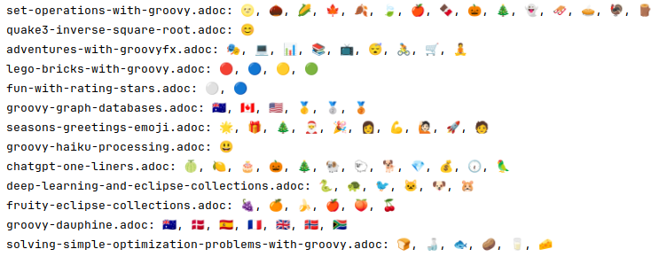

= Searching with Lucene
Paul King
:revdate: 2024-11-25T15:30:00+00:00
:keywords: aggregation, search, lucene, groovy, emoji, regex
:description: This post looks at using Lucene to find references to other projects in Groovy's blog posts.

The Groovy https://groovy.apache.org/blog/[blog posts] often reference other Apache projects.
Perhaps we'd like to know which other projects and which blog posts are involved.
Given that these pages are published, we could use something like https://nutch.apache.org[Apache Nutch] or
https://solr.apache.org[Apache Solr] to crawl/index those web pages and search using those tools.
For this post, we are going to search for the
information we require from the original source (https://asciidoc.org/[AsciiDoc]) files
which can be found in the
https://github.com/apache/groovy-website/tree/asf-site/site/src/site/blog[groovy-website] repo.
We'll first look at how we can find project references using regular expressions
and then using https://lucene.apache.org/[Apache Lucene].

== A regular expression for project names

For the sake of this post, let's assume that project references will
include the word "Apache" followed by the project name. To make it more
interesting, we'll also include references to Eclipse projects.
We'll also make provision for projects with subprojects, at least for
Apache Commons, so this will pick up names like "Apache Commons Math"
for instance. We'll exclude Apache Groovy since that would hit possibly
every Groovy blog post. We'll also exclude a bunch of words that appear in
commonly used phrases like "Apache License" and "Apache Projects" which
could look like project names to our search queries but aren't.

This is by no means a perfect name reference finder, for example,
we often refer to Apache Commons Math by its full name when first introduced
in a blog post but later in the post we fall back to the more friendly "Commons Math" reference
where the "Apache" is understood from the context. We could make the regex
more elaborate to cater for such cases but there isn't really any benefit
as far as this post is concerned, so we won't.

[source,groovy]
----
String tokenRegex = /(?ix)             # ignore case, enable whitespace & comments
    \b                                 # word boundary
    (                                  # start capture of all terms
        (                              # capture project name term
            (apache|eclipse)\s         # foundation name
            (commons\s)?               # optional subproject name
            (
                ?!(groovy              # negative lookahead for excluded words
                | and   | license  | users
                | https | projects | software
                | or    | prefixes | technologies)
            )\w+
        )                              # end capture project name term
        |                              # alternatively
        (                              # capture non-project term
            \w+?\b                     # non-greedily match any other word chars
        )                              # end capture non-project term
    )                                  # end capture term
/
----

We've used Groovy's multiline slashy string to save having to escape backslashes.
We've also enabled regex whitespace and comments to explain the regex.
Feel free to make a compact (long) one-liner without comments if you prefer.

== Collecting project name statistics using regex matching

With our regex in hand, let's look at how we could use a Groovy matcher
to find all the project names. First we'll define one other common constant,
the base directory for our blogs, which you might need to change if you
are wanting to follow along and run these examples:

[source,groovy]
----
String baseDir = '/projects/apache-websites/groovy-website/site/src/site/blog' // <1>
----
<1> You'd need to check out the Groovy website and point to it here

Now our script will traverse all the files in that directory, processing them with our regex
and track the hits we find.

[source,groovy]
----
var histogram = [:].withDefault { 0 } // <1>

new File(baseDir).traverse(nameFilter: ~/.*\.adoc/) { file ->  // <2>
    var m = file.text =~ tokenRegex // <3>
    var projects = m*.get(2).grep()*.toLowerCase()*.replaceAll('\n', ' ') // <4>
    var counts = projects.countBy() // <5>
    if (counts) {
        println "$file.name: $counts" // <6>
        counts.each { k, v -> histogram[k] += v } // <7>
    }
}

println "\nFrequency of total hits mentioning a project:"
histogram.sort { e -> -e.value }.each { k, v -> // <8>
    var label = "$k ($v)"
    println "${label.padRight(32)} ${bar(v, 0, 50, 50)}"
}
----
<1> This is a map which provides a default value for non-existent keys
<2> This traverses the directory processing each AsciiDoc file
<3> We define our matcher
<4> This pulls out project names (capture group 2), ignores other words (using grep), converts to lowercase, and removes newlines for the case where a term might span over the end of a line
<5> This aggregates the count hits for that file
<6> We print out each blog post file name and its project references
<7> We add the file aggregates to the overall aggregates
<8> We print out the pretty ascii barchart summarising the overall aggregates

When we run our script, the output looks like:

// &nbsp; entered below so that we don't hit this whole table as a bunch of references
++++
<pre>
apache-nlpcraft-with-groovy.adoc: [apache&nbsp;nlpcraft:5]
classifying-iris-flowers-with-deep.adoc: [eclipse&nbsp;deeplearning4j:5, apache&nbsp;commons math:1, apache&nbsp;spark:2]
community-over-code-eu-2024.adoc: [apache&nbsp;ofbiz:1, apache&nbsp;commons math:2, apache&nbsp;ignite:1, apache&nbsp;spark:1, apache&nbsp;wayang:1, apache&nbsp;beam:1, apache&nbsp;flink:1]
community-over-code-na-2023.adoc: [apache&nbsp;ignite:8, apache&nbsp;commons numbers:1, apache&nbsp;commons csv:1]
deck-of-cards-with-groovy.adoc: [eclipse&nbsp;collections:5]
deep-learning-and-eclipse-collections.adoc: [eclipse&nbsp;collections:7, eclipse&nbsp;deeplearning4j:2]
detecting-objects-with-groovy-the.adoc: [apache&nbsp;mxnet:12]
fruity-eclipse-collections.adoc: [eclipse&nbsp;collections:9, apache&nbsp;commons math:1]
fun-with-obfuscated-groovy.adoc: [apache&nbsp;commons math:1]
groovy-2-5-clibuilder-renewal.adoc: [apache&nbsp;commons cli:2]
groovy-graph-databases.adoc: [apache&nbsp;age:11, apache&nbsp;hugegraph:3, apache&nbsp;tinkerpop:3]
groovy-haiku-processing.adoc: [eclipse&nbsp;collections:3]
groovy-list-processing-cheat-sheet.adoc: [eclipse&nbsp;collections:4, apache&nbsp;commons collections:3]
groovy-lucene.adoc: [apache&nbsp;nutch:1, apache&nbsp;solr:1, apache&nbsp;lucene:2, apache&nbsp;commons:1, apache&nbsp;commons math:2]
groovy-null-processing.adoc: [eclipse&nbsp;collections:6, apache&nbsp;commons collections:4]
groovy-pekko-gpars.adoc: [apache&nbsp;pekko:4]
groovy-record-performance.adoc: [apache&nbsp;commons codec:1]
handling-byte-order-mark-characters.adoc: [apache&nbsp;commons io:1]
lego-bricks-with-groovy.adoc: [eclipse&nbsp;collections:6]
matrix-calculations-with-groovy-apache.adoc: [apache&nbsp;commons math:6, eclipse&nbsp;deeplearning4j:1, apache&nbsp;commons:1]
natural-language-processing-with-groovy.adoc: [apache&nbsp;opennlp:2, apache&nbsp;spark:1]
reading-and-writing-csv-files.adoc: [apache&nbsp;commons csv:2]
set-operations-with-groovy.adoc: [eclipse&nbsp;collections:3]
solving-simple-optimization-problems-with-groovy.adoc: [apache&nbsp;commons math:5, apache&nbsp;kie:1]
using-groovy-with-apache-wayang.adoc: [apache&nbsp;wayang:9, apache&nbsp;spark:7, apache&nbsp;flink:1, apache&nbsp;commons csv:1, apache&nbsp;ignite:1]
whiskey-clustering-with-groovy-and.adoc: [apache&nbsp;ignite:7, apache&nbsp;wayang:1, apache&nbsp;spark:2, apache&nbsp;commons csv:2]
wordle-checker.adoc: [eclipse&nbsp;collections:3]
zipping-collections-with-groovy.adoc: [eclipse&nbsp;collections:4]

Frequency of total hits mentioning a project:
eclipse&nbsp;collections (50)         ██████████████████████████████████████████████████▏
apache&nbsp;commons math (18)         ██████████████████▏
apache&nbsp;ignite (17)               █████████████████▏
apache&nbsp;spark (13)                █████████████▏
apache&nbsp;mxnet (12)                ████████████▏
apache&nbsp;wayang (11)               ███████████▏
apache&nbsp;age (11)                  ███████████▏
eclipse&nbsp;deeplearning4j (8)       ████████▏
apache&nbsp;commons collections (7)   ███████▏
apache&nbsp;commons csv (6)           ██████▏
apache&nbsp;nlpcraft (5)              █████▏
apache&nbsp;pekko (4)                 ████▏
apache&nbsp;hugegraph (3)             ███▏
apache&nbsp;tinkerpop (3)             ███▏
apache&nbsp;flink (2)                 ██▏
apache&nbsp;commons cli (2)           ██▏
apache&nbsp;lucene (2)                ██▏
apache&nbsp;commons (2)               ██▏
apache&nbsp;opennlp (2)               ██▏
apache&nbsp;ofbiz (1)                 █▏
apache&nbsp;beam (1)                  █▏
apache&nbsp;commons numbers (1)       █▏
apache&nbsp;nutch (1)                 █▏
apache&nbsp;solr (1)                  █▏
apache&nbsp;commons codec (1)         █▏
apache&nbsp;commons io (1)            █▏
apache&nbsp;kie (1)                   █▏
</pre>
++++

== Indexing with Lucene

image:https://www.apache.org/logos/res/lucene/default.png[lucene logo,200,float="right"]
Okay, regular expressions weren't that hard but in general we might want to search many things.
Search frameworks like Lucene help with that. Let's see what it looks like to apply
Lucene to our problem.

First, we'll define a custom analyzer. Lucene is very flexible and comes with builtin
analyzers. In a typical scenario, we might just index on all found words.
There's a builtin analyzer for that.
If we used one of the builtin analyzers, to query for our project names,
we'd need to construct a query that spanned multiple (word) terms.
We'll look at what that might look like later, but
for the purposes of our little example, we are going to assume project names
are indivisible terms and slice up our documents that way.

Luckily, Lucene has a pattern tokenizer
which lets us reuse our existing regex.
Basically, our index will have project name terms and other found words.

[source,groovy]
----
class ProjectNameAnalyzer extends Analyzer {
    @Override
    protected TokenStreamComponents createComponents(String fieldName) {
        var src = new PatternTokenizer(~tokenRegex, 0)
        var result = new LowerCaseFilter(src)
        new TokenStreamComponents(src, result)
    }
}
----

Let's now tokenize our documents and let Lucene index them.

[source,groovy]
----
var analyzer = new ProjectNameAnalyzer() // <1>
var indexDir = new ByteBuffersDirectory() // <2>
var config = new IndexWriterConfig(analyzer)

new IndexWriter(indexDir, config).withCloseable { writer ->
    var indexedWithFreq = new FieldType(stored: true,
        indexOptions: IndexOptions.DOCS_AND_FREQS,
        storeTermVectors: true)
    new File(baseDir).traverse(nameFilter: ~/.*\.adoc/) { file ->
        file.withReader { br ->
            var document = new Document()
            document.add(new Field('content', br.text, indexedWithFreq)) // <3>
            document.add(new StringField('name', file.name, Field.Store.YES)) // <4>
            writer.addDocument(document)
        }
    }
}
----
<1> This is our regex-based analyzer
<2> We'll use a memory-based index for our little example
<3> Store content of document along with term position info
<4> Also store the name of the file

With an index defined, we'd typically now perform some kind of search.
We'll do just that shortly, but first, for the kind of information we are interested in,
part of the Lucene API lets us explore the index. Here is how we might do that:

[source,groovy]
----
var reader = DirectoryReader.open(indexDir)
var vectors = reader.termVectors()
var storedFields = reader.storedFields()

Set projects = []
for (docId in 0..<reader.maxDoc()) {
    String name = storedFields.document(docId).get('name')
    TermsEnum terms = vectors.get(docId, 'content').iterator() // <1>
    var found = [:]
    while (terms.next() != null) {
        PostingsEnum postingsEnum = terms.postings(null, PostingsEnum.ALL)
        while (postingsEnum.nextDoc() != DocIdSetIterator.NO_MORE_DOCS) {
            int freq = postingsEnum.freq()
            var string = terms.term().utf8ToString().replaceAll('\n', ' ')
            if (string.startsWith('apache ') || string.startsWith('eclipse ')) { // <2>
                found[string] = freq
            }
        }
    }
    if (found) {
        println "$name: $found"
        projects += found.keySet()
    }
}

var terms = projects.collect { name -> new Term('content', name) }
var byReverseValue = { e -> -e.value }

println "\nFrequency of total hits mentioning a project (top 10):"
var termFreq = terms.collectEntries { term -> [term.text(), reader.totalTermFreq(term)] } // <3>
termFreq.sort(byReverseValue).take(10).each { k, v ->
    var label = "$k ($v)"
    println "${label.padRight(32)} ${bar(v, 0, 50, 50)}"
}

println "\nFrequency of documents mentioning a project (top 10):"
var docFreq = terms.collectEntries { term -> [term.text(), reader.docFreq(term)] } // <4>
docFreq.sort(byReverseValue).take(10).each { k, v ->
    var label = "$k ($v)"
    println "${label.padRight(32)} ${bar(v * 2, 0, 20, 20)}"
}
----
<1> Get all index terms
<2> Look for terms which match project names, so we can save them to a set
<3> Grab hit frequency metadata for each term in our set of terms
<4> Grab document frequency metadata for each term in our set of terms

When we run this we see:

// &nbsp; entered below so that we don't hit this whole table as a bunch of references
++++
<pre>
apache-nlpcraft-with-groovy.adoc: [apache&nbsp;nlpcraft:5]
classifying-iris-flowers-with-deep.adoc: [apache&nbsp;commons math:1, apache&nbsp;spark:2, eclipse&nbsp;deeplearning4j:5]
community-over-code-eu-2024.adoc: [apache&nbsp;beam:1, apache&nbsp;commons math:2, apache&nbsp;flink:1, apache&nbsp;ignite:1, apache&nbsp;ofbiz:1, apache&nbsp;spark:1, apache&nbsp;wayang:1]
community-over-code-na-2023.adoc: [apache&nbsp;commons csv:1, apache&nbsp;commons numbers:1, apache&nbsp;ignite:8]
deck-of-cards-with-groovy.adoc: [eclipse&nbsp;collections:5]
deep-learning-and-eclipse-collections.adoc: [eclipse&nbsp;collections:7, eclipse&nbsp;deeplearning4j:2]
detecting-objects-with-groovy-the.adoc: [apache&nbsp;mxnet:12]
fruity-eclipse-collections.adoc: [apache&nbsp;commons math:1, eclipse&nbsp;collections:9]
fun-with-obfuscated-groovy.adoc: [apache&nbsp;commons math:1]
groovy-2-5-clibuilder-renewal.adoc: [apache&nbsp;commons cli:2]
groovy-graph-databases.adoc: [apache&nbsp;age:11, apache&nbsp;hugegraph:3, apache&nbsp;tinkerpop:3]
groovy-haiku-processing.adoc: [eclipse&nbsp;collections:3]
groovy-list-processing-cheat-sheet.adoc: [apache&nbsp;commons collections:3, eclipse&nbsp;collections:4]
groovy-lucene.adoc: [apache&nbsp;commons:1, apache&nbsp;commons math:2, apache&nbsp;lucene:2, apache&nbsp;nutch:1, apache&nbsp;solr:1]
groovy-null-processing.adoc: [apache&nbsp;commons collections:4, eclipse&nbsp;collections:6]
groovy-pekko-gpars.adoc: [apache&nbsp;pekko:4]
groovy-record-performance.adoc: [apache&nbsp;commons codec:1]
handling-byte-order-mark-characters.adoc: [apache&nbsp;commons io:1]
lego-bricks-with-groovy.adoc: [eclipse&nbsp;collections:6]
matrix-calculations-with-groovy-apache.adoc: [apache&nbsp;commons:1, apache&nbsp;commons math:6, eclipse&nbsp;deeplearning4j:1]
natural-language-processing-with-groovy.adoc: [apache&nbsp;opennlp:2, apache&nbsp;spark:1]
reading-and-writing-csv-files.adoc: [apache&nbsp;commons csv:2]
set-operations-with-groovy.adoc: [eclipse&nbsp;collections:3]
solving-simple-optimization-problems-with-groovy.adoc: [apache&nbsp;commons math:4, apache&nbsp;kie:1]
using-groovy-with-apache-wayang.adoc: [apache&nbsp;commons csv:1, apache&nbsp;flink:1, apache&nbsp;ignite:1, apache&nbsp;spark:7, apache&nbsp;wayang:9]
whiskey-clustering-with-groovy-and.adoc: [apache&nbsp;commons csv:2, apache&nbsp;ignite:7, apache&nbsp;spark:2, apache&nbsp;wayang:1]
wordle-checker.adoc: [eclipse&nbsp;collections:3]
zipping-collections-with-groovy.adoc: [eclipse&nbsp;collections:4]

Frequency of total hits mentioning a project (top 10):
eclipse&nbsp;collections (50)         ██████████████████████████████████████████████████▏
apache&nbsp;commons math (17)         █████████████████▏
apache&nbsp;ignite (17)               █████████████████▏
apache&nbsp;spark (13)                █████████████▏
apache&nbsp;mxnet (12)                ████████████▏
apache&nbsp;wayang (11)               ███████████▏
apache&nbsp;age (11)                  ███████████▏
eclipse&nbsp;deeplearning4j (8)       ████████▏
apache&nbsp;commons collections (7)   ███████▏
apache&nbsp;commons csv (6)           ██████▏

Frequency of documents mentioning a project (top 10):
eclipse&nbsp;collections (10)         ████████████████████▏
apache&nbsp;commons math (7)          ██████████████▏
apache&nbsp;spark (5)                 ██████████▏
apache&nbsp;ignite (4)                ████████▏
apache&nbsp;commons csv (4)           ████████▏
eclipse&nbsp;deeplearning4j (3)       ██████▏
apache&nbsp;wayang (3)                ██████▏
apache&nbsp;flink (2)                 ████▏
apache&nbsp;commons collections (2)   ████▏
apache&nbsp;commons (2)               ████▏

</pre>
++++

So far, we have just displayed curated metadata about our index.
But just to show that we have an index that supports searching,
let's look for all documents which mention emojis.
They often make programming examples a lot of fun!

[source,groovy]
----
var parser = new QueryParser("content", analyzer)
var searcher = new IndexSearcher(reader)
var query = parser.parse('emoji*')
var results = searcher.search(query, 10)
println "\nTotal documents with hits for $query --> $results.totalHits"
results.scoreDocs.each {
    var doc = storedFields.document(it.doc)
    println "${doc.get('name')}"
}
----

When we run this we see:

----
Total documents with hits for content:emoji* --> 11 hits
adventures-with-groovyfx.adoc
create-groovy-blog.adoc
deep-learning-and-eclipse-collections.adoc
fruity-eclipse-collections.adoc
groovy-haiku-processing.adoc
groovy-lucene.adoc
helloworldemoji.adoc
seasons-greetings-emoji.adoc
set-operations-with-groovy.adoc
solving-simple-optimization-problems-with-groovy.adoc
----

Lucene has a very rich API. Let's now look at some alternative
ways we could use Lucene.

Rather than exploring index metadata, we'd more typically run queries
and explore those results. We'll look at how to do that now.
When exploring query results, we are going to use some classes in the `vectorhighlight`
package in the `lucene-highlight` module. You'd typically use functionality in that
module to highlight hits as part of potentially displaying them on a web page
as part of some web search functionality. For us, we are going to just
pick out the terms of interest, project names that match our query.

For the highlight functionality to work, we ask the indexer to store some additional information
when indexing, in particular term positions and offsets. The index code changes to look like this:

[source,groovy]
----
new IndexWriter(indexDir, config).withCloseable { writer ->
    new File(baseDir).traverse(nameFilter: ~/.*\.adoc/) { file ->
        file.withReader { br ->
            var document = new Document()
            var fieldType = new FieldType(stored: true,
                indexOptions: IndexOptions.DOCS_AND_FREQS_AND_POSITIONS_AND_OFFSETS,
                storeTermVectors: true,
                storeTermVectorPositions: true,
                storeTermVectorOffsets: true)
            document.add(new Field('content', br.text, fieldType))
            document.add(new StringField('name', file.name, Field.Store.YES))
            writer.addDocument(document)
        }
    }
}
----

We could have stored this additional information even for our previous example,
but it wasn't needed previously.

Next, we define a helper method to extract the actual project names from matches:

[source,groovy]
----
List<String> handleHit(ScoreDoc hit, Query query, DirectoryReader dirReader) {
    boolean phraseHighlight = true
    boolean fieldMatch = true
    var fieldQuery = new FieldQuery(query, dirReader, phraseHighlight, fieldMatch)
    var stack = new FieldTermStack(dirReader, hit.doc, 'content', fieldQuery)
    var phrases = new FieldPhraseList(stack, fieldQuery)
    phrases.phraseList*.termsInfos*.text.flatten() // <1>
}
----
<1> Converts a `FieldPhraseList` into a list of `TermInfo` instances into a list of strings

With our helper method defined, we can now write our query code:

[source,groovy]
----
var query = parser.parse(/apache\ * OR eclipse\ */) // <1>
var results = searcher.search(query, 30) // <2>
println "Total documents with hits for $query --> $results.totalHits\n"

var storedFields = searcher.storedFields()
var histogram = [:].withDefault { 0 }
results.scoreDocs.each { ScoreDoc scoreDoc -> // <3>
    var doc = storedFields.document(scoreDoc.doc)
    var found = handleHit(scoreDoc, query, reader) // <4>
    println "${doc.get('name')}: ${found*.replaceAll('\n', ' ').countBy()}"
    found.each { histogram[it.replaceAll('\n', ' ')] += 1 } // <5>
}

println "\nFrequency of total hits mentioning a project (top 10):"
histogram.sort { e -> -e.value }.take(10).each { k, v -> // <6>
    var label = "$k ($v)"
    println "${label.padRight(32)} ${bar(v, 0, 50, 50)}"
}
----
<1> Search for terms with the apache or eclipse prefixes
<2> Perform our query with a limit of 30 results
<3> Process each result
<4> Pull out the actual matched terms
<5> Also aggregate the counts
<6> Display the top 10 aggregates as a pretty barchart

The output is essentially the same as before:

// &nbsp; used instead of space below so that we don't hit this whole table as a bunch of project references
++++
<pre>
Total documents with hits for content:apache&nbsp;* content:eclipse&nbsp;* --> 28 hits

classifying-iris-flowers-with-deep.adoc: [eclipse&nbsp;deeplearning4j:5, apache&nbsp;commons math:1, apache&nbsp;spark:2]
fruity-eclipse-collections.adoc: [eclipse&nbsp;collections:9, apache&nbsp;commons math:1]
groovy-list-processing-cheat-sheet.adoc: [eclipse&nbsp;collections:4, apache&nbsp;commons collections:3]
groovy-null-processing.adoc: [eclipse&nbsp;collections:6, apache&nbsp;commons collections:4]
matrix-calculations-with-groovy-apache.adoc: [apache&nbsp;commons math:6, eclipse&nbsp;deeplearning4j:1, apache&nbsp;commons:1]
apache-nlpcraft-with-groovy.adoc: [apache&nbsp;nlpcraft:5]
community-over-code-eu-2024.adoc: [apache&nbsp;ofbiz:1, apache&nbsp;commons math:2, apache&nbsp;ignite:1, apache&nbsp;spark:1, apache&nbsp;wayang:1, apache&nbsp;beam:1, apache&nbsp;flink:1]
community-over-code-na-2023.adoc: [apache&nbsp;ignite:8, apache&nbsp;commons numbers:1, apache&nbsp;commons csv:1]
deck-of-cards-with-groovy.adoc: [eclipse&nbsp;collections:5]
deep-learning-and-eclipse-collections.adoc: [eclipse&nbsp;collections:7, eclipse&nbsp;deeplearning4j:2]
detecting-objects-with-groovy-the.adoc: [apache&nbsp;mxnet:12]
fun-with-obfuscated-groovy.adoc: [apache&nbsp;commons math:1]
groovy-2-5-clibuilder-renewal.adoc: [apache&nbsp;commons cli:2]
groovy-graph-databases.adoc: [apache&nbsp;age:11, apache&nbsp;hugegraph:3, apache&nbsp;tinkerpop:3]
groovy-haiku-processing.adoc: [eclipse&nbsp;collections:3]
groovy-lucene.adoc: [apache&nbsp;nutch:1, apache&nbsp;solr:1, apache&nbsp;lucene:2, apache&nbsp;commons:1, apache&nbsp;commons math:2]
groovy-pekko-gpars.adoc: [apache&nbsp;pekko:4]
groovy-record-performance.adoc: [apache&nbsp;commons codec:1]
handling-byte-order-mark-characters.adoc: [apache&nbsp;commons io:1]
lego-bricks-with-groovy.adoc: [eclipse&nbsp;collections:6]
natural-language-processing-with-groovy.adoc: [apache&nbsp;opennlp:2, apache&nbsp;spark:1]
reading-and-writing-csv-files.adoc: [apache&nbsp;commons csv:2]
set-operations-with-groovy.adoc: [eclipse&nbsp;collections:3]
solving-simple-optimization-problems-with-groovy.adoc: [apache&nbsp;commons math:5, apache&nbsp;kie:1]
using-groovy-with-apache-wayang.adoc: [apache&nbsp;wayang:9, apache&nbsp;spark:7, apache&nbsp;flink:1, apache&nbsp;commons csv:1, apache&nbsp;ignite:1]
whiskey-clustering-with-groovy-and.adoc: [apache&nbsp;ignite:7, apache&nbsp;wayang:1, apache&nbsp;spark:2, apache&nbsp;commons csv:2]
wordle-checker.adoc: [eclipse&nbsp;collections:3]
zipping-collections-with-groovy.adoc: [eclipse&nbsp;collections:4]

Frequency of total hits mentioning a project (top 10):
eclipse&nbsp;collections (50)         ██████████████████████████████████████████████████▏
apache&nbsp;commons math (18)         ██████████████████▏
apache&nbsp;ignite (17)               █████████████████▏
apache&nbsp;spark (13)                █████████████▏
apache&nbsp;mxnet (12)                ████████████▏
apache&nbsp;wayang (11)               ███████████▏
apache&nbsp;age (11)                  ███████████▏
eclipse&nbsp;deeplearning4j (8)       ████████▏
apache&nbsp;commons collections (7)   ███████▏
apache&nbsp;commons csv (6)           ██████▏

</pre>
++++

We could also aggregate file counts which mention project names. It too, would look the same as before.

== Using Lucene Facets

As well as the metadata Lucene stores for its own purposes in the index,
Lucene provides a mechanism, called facets, for storing custom metadata.
Facets allow for more powerful searching. They are often used for grouping
search results into categories. The search user can drill down into
categories to refine their search.

NOTE: Facets are a really powerful feature. Given that we are indexing asciidoc source
files, we could even use libraries like https://github.com/asciidoctor/asciidoctorj[AsciidoctorJ]
to extract more metadata from our source files and store them as facets.
We could for instance extra titles, author(s), keywords, publication dates and so forth.
This would allow us to make some pretty powerful searches.
We leave this as an exercise for the reader.
But if you try, please let us know how you go!

Let's use facets to store project names for each document.
One facet capturing the project name information might be all we need,
but to illustrate some Lucene features, we'll use three facets and
store slightly different information in each one:

|===
|Facet |Type |Description/Example

|`projectHitCounts`
|`IntAssociationFacetField`
|Project reference hit counts, e.g.
"Apache Lucene" has 2 hits in `groovy-lucene.adoc`

|`projectFileCounts`
|`FacetField`
|Documents which reference a project, e.g.
"Apache Spark" is referenced by
`classifying-iris-flowers-with-deep.adoc`

|`projectNameCounts`
|`FacetField`
|As above but hierarchical, e.g.
["Apache", "Commons", "Math"] is reference by
`fruity-eclipse-collections.adoc`
|===

We'll use our regex to find project names and store the information in our facets.
Lucene creates a special _taxonomy_ index for indexing facet information.
We'll also enable that.

[source,groovy]
----
var analyzer = new ProjectNameAnalyzer()
var indexDir = new ByteBuffersDirectory()
var taxonDir = new ByteBuffersDirectory()
var config = new IndexWriterConfig(analyzer)
var indexWriter = new IndexWriter(indexDir, config) // <1>
var taxonWriter = new DirectoryTaxonomyWriter(taxonDir) // <2>

var fConfig = new FacetsConfig().tap { // <3>
    setHierarchical('projectNameCounts', true)
    setMultiValued('projectNameCounts', true)
    setMultiValued('projectFileCounts', true)
    setMultiValued('projectHitCounts', true)
    setIndexFieldName('projectHitCounts', '$projectHitCounts')
}

new File(baseDir).traverse(nameFilter: ~/.*\.adoc/) { file ->
    var m = file.text =~ tokenRegex
    var projects = m*.get(2).grep()*.toLowerCase()*.replaceAll('\n', ' ').countBy()
    file.withReader { br ->
        var document = new Document()
        var indexedWithFreq = new FieldType(stored: true,
            indexOptions: IndexOptions.DOCS_AND_FREQS,
            storeTermVectors: true)
        document.add(new Field('content', br.text, indexedWithFreq))
        document.add(new StringField('name', file.name, Field.Store.YES))
        if (projects) {
            println "$file.name: $projects"
            projects.each { k, v -> // <4>
                document.add(new IntAssociationFacetField(v, 'projectHitCounts', k))
                document.add(new FacetField('projectFileCounts', k))
                document.add(new FacetField('projectNameCounts', k.split()))
            }
        }
        indexWriter.addDocument(fConfig.build(taxonWriter, document))
    }
}
indexWriter.close()
taxonWriter.close()
----
<1> Our normal index writer
<2> A writer for our taxonomy
<3> Define some properties for the facets we are interested in
<4> We add our facets of interest to our document

Since we are collecting our project names during indexing, we can print then out:

++++
<pre>
apache-nlpcraft-with-groovy.adoc: [apache&nbsp;nlpcraft:5]
classifying-iris-flowers-with-deep.adoc: [eclipse&nbsp;deeplearning4j:5, apache&nbsp;commons math:1, apache&nbsp;spark:2]
community-over-code-eu-2024.adoc: [apache&nbsp;ofbiz:1, apache&nbsp;commons math:2, apache&nbsp;ignite:1, apache&nbsp;spark:1, apache&nbsp;wayang:1, apache&nbsp;beam:1, apache&nbsp;flink:1]
community-over-code-na-2023.adoc: [apache&nbsp;ignite:8, apache&nbsp;commons numbers:1, apache&nbsp;commons csv:1]
deck-of-cards-with-groovy.adoc: [eclipse&nbsp;collections:5]
deep-learning-and-eclipse-collections.adoc: [eclipse&nbsp;collections:7, eclipse&nbsp;deeplearning4j:2]
detecting-objects-with-groovy-the.adoc: [apache&nbsp;mxnet:12]
fruity-eclipse-collections.adoc: [eclipse&nbsp;collections:9, apache&nbsp;commons math:1]
fun-with-obfuscated-groovy.adoc: [apache&nbsp;commons math:1]
groovy-2-5-clibuilder-renewal.adoc: [apache&nbsp;commons cli:2]
groovy-graph-databases.adoc: [apache&nbsp;age:11, apache&nbsp;hugegraph:3, apache&nbsp;tinkerpop:3]
groovy-haiku-processing.adoc: [eclipse&nbsp;collections:3]
groovy-list-processing-cheat-sheet.adoc: [eclipse&nbsp;collections:4, apache&nbsp;commons collections:3]
groovy-lucene.adoc: [apache&nbsp;nutch:1, apache&nbsp;solr:1, apache&nbsp;lucene:2, apache&nbsp;commons:1, apache&nbsp;commons math:2]
groovy-null-processing.adoc: [eclipse&nbsp;collections:6, apache&nbsp;commons collections:4]
groovy-pekko-gpars.adoc: [apache&nbsp;pekko:4]
groovy-record-performance.adoc: [apache&nbsp;commons codec:1]
handling-byte-order-mark-characters.adoc: [apache&nbsp;commons io:1]
lego-bricks-with-groovy.adoc: [eclipse&nbsp;collections:6]
matrix-calculations-with-groovy-apache.adoc: [apache&nbsp;commons math:6, eclipse&nbsp;deeplearning4j:1, apache&nbsp;commons:1]
natural-language-processing-with-groovy.adoc: [apache&nbsp;opennlp:2, apache&nbsp;spark:1]
reading-and-writing-csv-files.adoc: [apache&nbsp;commons csv:2]
set-operations-with-groovy.adoc: [eclipse&nbsp;collections:3]
solving-simple-optimization-problems-with-groovy.adoc: [apache&nbsp;commons math:5, apache&nbsp;kie:1]
using-groovy-with-apache-wayang.adoc: [apache&nbsp;wayang:9, apache&nbsp;spark:7, apache&nbsp;flink:1, apache&nbsp;commons csv:1, apache&nbsp;ignite:1]
whiskey-clustering-with-groovy-and.adoc: [apache&nbsp;ignite:7, apache&nbsp;wayang:1, apache&nbsp;spark:2, apache&nbsp;commons csv:2]
wordle-checker.adoc: [eclipse&nbsp;collections:3]
zipping-collections-with-groovy.adoc: [eclipse&nbsp;collections:4]

</pre>
++++

Now when doing searches, we can extract the taxonomy information along with other info.
With `projectHitCounts` we can gather the taxonomy metadata for the top hits from our search.
We'll use `MatchAllDocsQuery` to match all documents, i.e. the metadata will be for
all documents.

[source,groovy]
----
var reader = DirectoryReader.open(indexDir)
var searcher = new IndexSearcher(reader)
var taxonReader = new DirectoryTaxonomyReader(taxonDir)
var fcm = new FacetsCollectorManager()
var fc = FacetsCollectorManager.search(searcher, new MatchAllDocsQuery(), 0, fcm).facetsCollector()

var topN = 5
var projects = new TaxonomyFacetIntAssociations('$projectHitCounts', taxonReader, fConfig, fc, AssociationAggregationFunction.SUM)
var hitData = projects.getTopChildren(topN, 'projectHitCounts').labelValues

println "\nFrequency of total hits mentioning a project (top $topN):"
hitData.each { m ->
    var label = "$m.label ($m.value)"
    println "${label.padRight(32)} ${bar(m.value, 0, 50, 50)}"
}

println "\nFrequency of documents mentioning a project (top $topN):"
hitData.each { m ->
    var label = "$m.label ($m.count)"
    println "${label.padRight(32)} ${bar(m.count * 2, 0, 20, 20)}"
}
----

When running this we can see the frequencies for the total hits and number of files:

// &nbsp; entered below so that we don't hit this whole table as a bunch of references
++++
<pre>
Frequency of total hits mentioning a project (top 5):
eclipse&nbsp;collections (50)         ██████████████████████████████████████████████████▏
apache&nbsp;commons math (18)         ██████████████████▏
apache&nbsp;ignite (17)               █████████████████▏
apache&nbsp;spark (13)                █████████████▏
apache&nbsp;mxnet (12)                ████████████▏

Frequency of documents mentioning a project (top 5):
eclipse&nbsp;collections (10)         ████████████████████▏
apache&nbsp;commons math (7)          ██████████████▏
apache&nbsp;spark (5)                 ██████████▏
apache&nbsp;ignite (4)                ████████▏
apache&nbsp;mxnet (1)                 ██▏

</pre>
++++

NOTE: At the time of writing, there is a bug in sorting for the second of these graphs.
A https://github.com/apache/lucene/issues/14008[fix] is coming.

Now, the taxonomy information about document frequency is for the top hits scored using the number of hits.
One of our other facets (`projectFileCounts`) tracks document frequency independently.
Let's look at how we can query that information:

[source,groovy]
----
var facets = new FastTaxonomyFacetCounts(taxonReader, fConfig, fc)

println "\nFrequency of documents mentioning a project (top $topN):"
println facets.getTopChildren(topN, 'projectFileCounts')
----

We could display our search result (a `FacetResult` instance) as a barchart
like we've done before, but the `toString` for the result is also quite informative.
Here is what running the above code looks like:

++++
<pre>
Frequency of documents mentioning a project (top 5):
dim=projectFileCounts path=[] value=-1 childCount=27
  eclipse&nbsp;collections (10)
  apache&nbsp;commons math (7)
  apache&nbsp;spark (5)
  apache&nbsp;ignite (4)
  apache&nbsp;commons csv (4)

</pre>
++++

When comparing this result, with the result from our previous facet,
we can see that commons csv is mentioned in more files than mxnet,
even though mxnet is mentioned more times. In general, you'd decide
which document frequency is of more interest to you, and you'd skip
the `projectFileCounts` facet if you didn't need that extra information.

Our final facet (`projectNameCounts`) is a hierarchical facet. These are typically used interactively
when "browsing" search results. We can look at project names by first word, e.g. the foundation.
We could then drill down into one of the foundations, e.g. "Apache", and find referenced projects,
and then in the case of commons, we could drill down into its subprojects.
Here is the code which does that.

[source,groovy]
----
['apache', 'commons'].inits().reverseEach { path -> // <1>
    println "Frequency of documents mentioning a project with path $path (top $topN):"
    println "${facets.getTopChildren(topN, 'projectNameCounts', *path)}"
}
----
<1> The `inits()` method returns all prefixes of a list including the empty list.

The output looks like this:

++++
<pre>
Frequency of documents mentioning a project with path [] (top 5):
dim=projectNameCounts path=[] value=-1 childCount=2
  apache (21)
  eclipse (12)

Frequency of documents mentioning a project with path [apache] (top 5):
dim=projectNameCounts path=[apache] value=-1 childCount=18
  commons (16)
  spark (5)
  ignite (4)
  wayang (3)
  flink (2)

Frequency of documents mentioning a project with path [apache, commons] (top 5):
dim=projectNameCounts path=[apache, commons] value=-1 childCount=7
  math (7)
  csv (4)
  collections (2)
  numbers (1)
  cli (1)

</pre>
++++

We now have a taxonomy index as well as the normal one, so we can still do adhoc queries
which might just use the latter.

[source,groovy]
----
var parser = new QueryParser('content', analyzer)
var query = parser.parse(/apache\ * AND eclipse\ * AND emoji*/)
var results = searcher.search(query, topN)
var storedFields = searcher.storedFields()
assert results.totalHits.value() == 1 &&
    storedFields.document(results.scoreDocs[0].doc).get('name') == 'fruity-eclipse-collections.adoc'
----

This query shows that there is exactly one blog post that mentions
Apache projects, Eclipse projects, and also emojis.

== More complex queries

As a final example, we chose earlier to extract project names at index time.
We could have instead used a more typical analyzer at the cost of needing more
complex span queries to pull out our project names at search time.
Let's have a look at what the code for that scenario could look like.

First, we'll do indexing with the `StandardAnalyzer`.

[source,groovy]
----
var analyzer = new StandardAnalyzer()
var indexDir = new ByteBuffersDirectory()
var config = new IndexWriterConfig(analyzer)

new IndexWriter(indexDir, config).withCloseable { writer ->
    new File(baseDir).traverse(nameFilter: ~/.*\.adoc/) { file ->
        file.withReader { br ->
            var document = new Document()
            var fieldType = new FieldType(stored: true,
              indexOptions: IndexOptions.DOCS_AND_FREQS_AND_POSITIONS_AND_OFFSETS,
              storeTermVectors: true,
              storeTermVectorPositions: true,
              storeTermVectorOffsets: true)
            document.add(new Field('content', br.text, fieldType))
            document.add(new StringField('name', file.name, Field.Store.YES))
            writer.addDocument(document)
        }
    }
}
----

Now our queries will need to be more complex. We have a few options up our sleeve,
but we'll choose to put together our queries using some of Lucene's low-level query classes.

NOTE: Before considering Lucene's low-level query classes, you might
want to look at some of Lucene's higher-level query classes like the `QueryParser` class.
It supports representing a query as a string and includes support for phrases,
ranges, regex terms and so forth. As far as I am aware, it doesn't support
a regex within a phrase, hence the low-level classes we'll explore below.

We'll look for expressions like "apache commons <suffix>"
or "(apache|eclipse) <suffix>",
where _suffix_ is the project name
without the foundation prefix, or in the case of Apache Commons, the subproject name.

Instead of having a list of stop words (excluded words) like in our regex,
we'll just have a list of allowable project suffix names.
It wouldn't be hard to swap to the stop word approach if we wanted.

[source,groovy]
----
IndexReader reader = DirectoryReader.open(indexDir)
var searcher = new IndexSearcher(reader)

var projects = [
    'math', 'spark', 'lucene', 'collections', 'deeplearning4j',
    'beam', 'wayang', 'csv', 'io', 'numbers', 'ignite', 'mxnet', 'age',
    'nlpcraft', 'pekko', 'hugegraph', 'tinkerpop', 'commons',
    'cli', 'opennlp', 'ofbiz', 'codec', 'kie', 'flink'
]
var suffix = new SpanMultiTermQueryWrapper(new RegexpQuery( // <1>
    new Term('content', "(${projects.join('|')})")))

// look for apache commons <suffix>
SpanQuery[] spanTerms = ['apache', 'commons'].collect{
    new SpanTermQuery(new Term('content', it))
} + suffix
var apacheCommons = new SpanNearQuery(spanTerms, 0, true)

// look for (apache|eclipse) <suffix>
var foundation = new SpanMultiTermQueryWrapper(new RegexpQuery(
    new Term('content', '(apache|eclipse)')))
var otherProject = new SpanNearQuery([foundation, suffix] as SpanQuery[], 0, true)

var builder = new BooleanQuery.Builder(minimumNumberShouldMatch: 1)
builder.add(otherProject, BooleanClause.Occur.SHOULD)
builder.add(apacheCommons, BooleanClause.Occur.SHOULD)
var query = builder.build()
var results = searcher.search(query, 30)
println "Total documents with hits for $query --> $results.totalHits"
----
<1> Regex queries are wrapped to appear in a span query

When we run this we see the same number of hits as before:

----
Total documents with hits for (spanNear([SpanMultiTermQueryWrapper(content:/(apache|eclipse)/), SpanMultiTermQueryWrapper(content:/(math|spark|lucene|collections|deeplearning4j|beam|wayang|csv|io|numbers|ignite|mxnet|age|nlpcraft|pekko|hugegraph|tinkerpop|commons|cli|opennlp|ofbiz|codec|kie|flink)/)], 0, true) spanNear([content:apache, content:commons, SpanMultiTermQueryWrapper(content:/(math|spark|lucene|collections|deeplearning4j|beam|wayang|csv|io|numbers|ignite|mxnet|age|nlpcraft|pekko|hugegraph|tinkerpop|commons|cli|opennlp|ofbiz|codec|kie|flink)/)], 0, true))~1 --> 28 hits
----

Another thing we might want to consider for this example is to make use of
Groovy's excellent Domain Specific Language (DSL) capabilities.
By defining one helper method, `span`, and providing one metaprogramming
extension for `or` on Lucene's `Query` class, we can rewrite the last 20 lines
of the previous example in a more compact and understandable form:

[source,groovy]
----
var suffix = "(${projects.join('|')})"
var query = span('apache', 'commons', ~suffix) | span(~'(apache|eclipse)', ~suffix)
var results = searcher.search(query, 30)
println "Total documents with hits for $query --> $results.totalHits"
----

Running the code gives the same output as previously. If you are interested in the DSL
details, have a look at the https://github.com/paulk-asert/groovy-lucene/blob/main/src/main/groovy/LuceneDSL.groovy[source file].

We can try out our DSL on other terms:

[source,groovy]
----
query = span('jackson', 'databind') | span(~'virt.*', 'threads')
results = searcher.search(query, 30)
println "Total documents with hits for $query --> $results.totalHits"
----

When run, we'll now see this output:

----
Total documents with hits for (spanNear([content:jackson, content:databind], 0, true) spanNear([SpanMultiTermQueryWrapper(content:/virt.*/), content:threads], 0, true))~1 --> 8 hits
----

Using the `StandardAnalyzer` with span queries certainly opens up the possibility
of a much wider range of queries. But `StandardAnalyzer` also has other advantages.
It has baked into it the ability for stop words, smart word breaking, lowercasing
and other features. Other built-in analyzers might also be useful. We could of course,
also make our regex-based analyzer smarter. The fact that many of Lucene's features
are in reusable pieces certainly helps.

A fun advantage of the `StandardAnalyzer` is that it properly handles emojis in our index.
Our regex analyzer in its current form only looks for "regex word" characters which doesn't
include emoji characters, although it could be expanded to support them.

Given that we've used `StandardAnalyzer` here, let's look again at terms
in our index but this time pull out emojis instead of project names:

[source,groovy]
----
var vectors = reader.termVectors()
var storedFields = reader.storedFields()

var emojis = [:].withDefault { [] as Set }
for (docId in 0..<reader.maxDoc()) {
    String name = storedFields.document(docId).get('name')
    TermsEnum terms = vectors.get(docId, 'content').iterator()
    while (terms.next() != null) {
        PostingsEnum postingsEnum = terms.postings(null, PostingsEnum.ALL)
        while (postingsEnum.nextDoc() != DocIdSetIterator.NO_MORE_DOCS) {
            var string = terms.term().utf8ToString()
            if (string.codePoints().allMatch(Character::isEmojiPresentation)) {
                emojis[name] += string
            }
        }
    }
}
emojis.collect { k, v -> "$k: ${v.join(', ')}" }.each { println it }
----

When run, you should see something like this (flag emojis may not show up on some platforms):

== References

* Lucene project https://lucene.apache.org/[website]
* Source code https://github.com/paulk-asert/groovy-lucene[examples] for this blog post

== Conclusion

We have analyzed the Groovy blog posts looking for referenced projects
using regular expressions and Apache Lucene. Hopefully this gives you a taste
of the Lucene APIs and some of Groovy's features.
