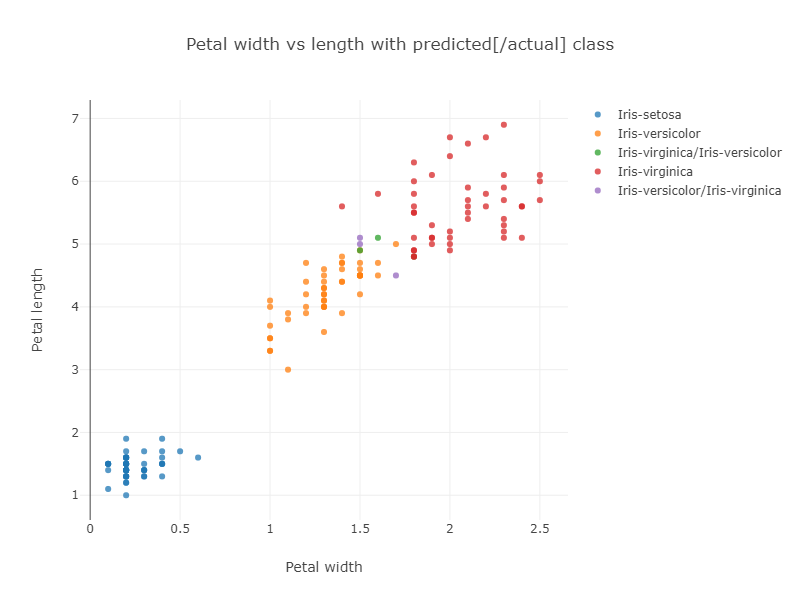
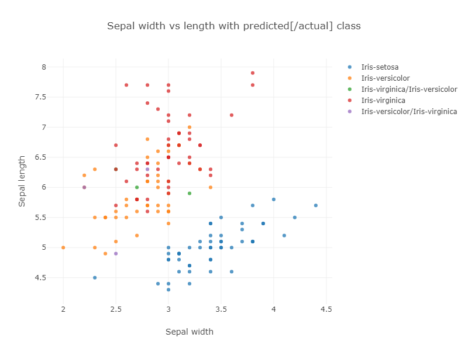
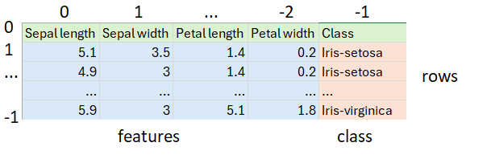
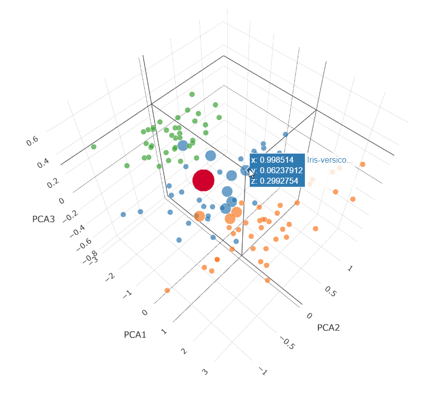

= Using the Oracle 23ai Vector data type with Groovy to classify Iris flowers
Paul King
:revdate: 2024-06-30T23:21:10+00:00
:keywords: oracle, jdbc, groovy, classification
:description: This post looks at using the Oracle 23ai Vector data type with Groovy.

image:img/iris_flowers.png[iris flowers,200,float="right"]
A classic data science https://en.wikipedia.org/wiki/Iris_flower_data_set[dataset] captures flower characteristics of Iris flowers.
It captures the _width_ and _length_ of the _sepals_ and _petals_ for three _species_ (https://en.wikipedia.org/wiki/Iris_setosa[Setosa], https://en.wikipedia.org/wiki/Iris_versicolor[Versicolor], and https://en.wikipedia.org/wiki/Iris_virginica[Virginica]).

The https://github.com/paulk-asert/groovy-data-science/tree/master/subprojects/Iris[Iris project] in the https://github.com/paulk-asert/groovy-data-science[groovy-data-science repo] is dedicated to this example.
It includes a number of Groovy scripts and a Jupyter/BeakerX notebook highlighting this example
comparing and contrasting various libraries and various classification algorithms.

A previous https://groovy.apache.org/blog/classifying-iris-flowers-with-deep[blog post]
describes this example  using several deep learning libraries and gave a solution utilizing GraalVM.
In this blog post, we'll look at using Oracle 23ai's Vector data type and Vector AI
queries to classify part of our dataset.

In general, many machine learning/AI algorithms process vectors of information.
Such information might be actual data values, like the characteristics for our flowers, or projections
of data values, or representations of important information of text,
video, images or sound files. The latter is often called embeddings.

For us, we'll find flowers with similar characteristics. In other similarity
search scenarios, we might detect fraudulent transactions, find customer recommendations,
or find similar images based on the "closeness"
of their embeddings.

== The dataset

The previously mentioned https://github.com/paulk-asert/groovy-data-science/tree/master/subprojects/Iris[Iris Project]
shows how to classify the Iris dataset using various techniques. In particular, one example uses the http://haifengl.github.io/[Smile] library's
kNN classification algorithm. The example uses the whole dataset to train the model
and then runs the model on the whole dataset to gauge its accuracy. The algorithm
has some trouble with the data points near the overlap of the Virginica and Versicolor
groupings as shown in the resulting graph of classification vs petal size:

If we look at classification vs sepal size, we can see even more chance of confusion:

The purple and green points show the incorrectly classified flowers.

The corresponding confusion matrix also shows these results:

[subs="quotes"]
----
Confusion matrix:
ROW=truth and COL=predicted
class  0 |      50 |       0 |       0 |
class  1 |       0 |      47 |       *3* |
class  2 |       0 |       *3* |      47 |
----

In general, running a model on the original dataset might not be ideal
in the sense we won't get accurate error calculations, but it does
highlight some important information about our data. In our case
we can see that the Virginica and Versacolor classes become congested,
and data points near where the two groups overlap might be expected
to be prone to mis-classification.

== The database solution

Our data is stored in a CSV file:

It happens to have 50 each of the three classes of Iris.
First, we load our dataset from the CSV file, skipping the header row
and shuffling the remaining rows to ensure we'll test against a random
mixture of the three classes of Iris:

[source,groovy]
----
var file = getClass().classLoader.getResource('iris_data.csv').file as File
var rows = file.readLines()[1..-1].shuffled() // skip header and shuffle
var (training, test) = rows.chop(rows.size() * .8 as int, -1)
----

After shuffling, we split the data into two sets.
The first 80% will go into the database.
It corresponds to "training" data in normal data science terminology.
The last 20% will correspond to our "test" data.

Next, we define the required information for our SQL connection:

[source,groovy]
----
var url = 'jdbc:oracle:thin:@localhost:1521/FREEPDB1'
var user = 'some_user'
var password = 'some_password'
var driver = 'oracle.jdbc.driver.OracleDriver'
----

Next, we create our database connection and use it to insert the "training" rows,
before testing against the "test" rows:
[source,groovy]
----
Sql.withInstance(url, user, password, driver) { sql ->
    training.each { row ->
        var data = row.split(',')
        var features = data[0..-2].toString()
        sql.executeInsert """
            INSERT INTO Iris (class, features) VALUES (${data[-1]}, $features)
        """
    }
    printf "%-20s%-20s%-20s%n", 'Actual', 'Predicted', 'Confidence'
    test.each { row ->
        var data = row.split(',')
        var features = VECTOR.ofFloat64Values(data[0..-2]*.toDouble() as double[])
        var closest10 = sql.rows """
        select class from Iris
        order by vector_distance(features, $features, EUCLIDEAN)
        fetch first 10 rows only
        """
        var results = closest10
                .groupBy{ e -> e.CLASS }
                .collectEntries { e -> [e.key, e.value.size()]}
        var predicted = results.max{ e -> e.value }
        printf "%-20s%-20s%5d%n", data[-1], predicted.key, predicted.value * 10
    }
}
----

There are some interesting aspects to this code.

* When we inserted the data, we just used strings. Because the type of the
`features` column is known, it converts it automatically.
* We can alternatively, explicitly handle types, as shown for the query where
`VECTOR.ofFloat64Values` is used.
* What might seem strange is that no model is actually trained like
a traditional algorithm might do. Instead, the `vector_distance` function
in the SQL query invokes a kNN based search to find results. In our
case we asked for the top 10 closest points.
* We used the `EUCLIDEAN` distance measure in our query but had we chosen
`EUCLIDEAN_SQUARED`, we would have obtained similar results with faster execution time.
Intuitively, if two points are close to one another, both measures will be small whereas
if two points are unrelated, both measures will be large.
If our feature characteristics were normalized, we'd expect the same result.
* The `COSINE` distance measure also works remarkably well.
Intuitively, if it's not the actual size of the sepals and petals that
is important but their ratios, then similar flowers will be on the same
angle on our 2D plots, and that is what `COSINE` measures. For this
dataset, both matter but either measure gets all (or nearly all)
correct.
* Once we have the top 10 closest points, the class prediction is simply
the most predicated class from the 10 results. Our confidence indicates
how many of the top 10 agreed with the prediction.

The output looks like this:

[subs="quotes"]
----
Actual              Predicted           Confidence
Iris-virginica      Iris-virginica         90
Iris-virginica      Iris-virginica         90
Iris-virginica      Iris-virginica        100
Iris-virginica      Iris-virginica        100
*Iris-virginica      Iris-versicolor        60*
Iris-setosa         Iris-setosa           100
Iris-setosa         Iris-setosa           100
Iris-setosa         Iris-setosa           100
Iris-setosa         Iris-setosa           100
Iris-setosa         Iris-setosa           100
Iris-virginica      Iris-virginica        100
Iris-versicolor     Iris-versicolor       100
Iris-versicolor     Iris-versicolor       100
*Iris-versicolor     Iris-versicolor        70*
Iris-virginica      Iris-virginica        100
Iris-virginica      Iris-virginica        100
Iris-setosa         Iris-setosa           100
Iris-versicolor     Iris-versicolor       100
Iris-virginica      Iris-virginica        100
Iris-versicolor     Iris-versicolor       100
Iris-setosa         Iris-setosa           100
Iris-setosa         Iris-setosa           100
Iris-versicolor     Iris-versicolor       100
Iris-virginica      Iris-virginica         90
Iris-setosa         Iris-setosa           100
Iris-virginica      Iris-virginica         90
Iris-setosa         Iris-setosa           100
Iris-setosa         Iris-setosa           100
Iris-virginica      Iris-virginica        100
Iris-virginica      Iris-virginica        100
----

Only one result was incorrect (first *bold* line above).
Since we randomly shuffled the data,  we might get a
different number of incorrect results for other runs.

We can visualize how the distance query works
by plotting the closest 10 points in a 3D plot.
We'll do this for the points returned for the 70%
confidence case (second *bold* line above):

This is a Principal Component Analysis (PCA) plot
which projects our 4 dimensions (Petal width and length,
Sepal width and length) down onto 3 dimensions.

The large red dot is the projection for our test query characteristics.
The small dots are the unselected points in our dataset.
The medium dots are the dots returned by our `vector_distance`
query.
7 Versicolor points (blue) were returned and 3 Virginica points (orange) were returned.
We know the result was Versicolor for that data point.

== More Information

* Source code: https://github.com/paulk-asert/groovy-oracle23ai
* https://docs.groovy-lang.org/latest/html/documentation/sql-userguide.html[Groovy SQL User Guide]
* https://docs.oracle.com/en/database/oracle/oracle-database/23/vecse/oracle-ai-vector-search-users-guide.pdf[Oracle AI Vector Search User's Guide]

== Conclusion

We have had a quick glimpse at using the Vector data type from Oracle 23ai with Apache Groovy.
